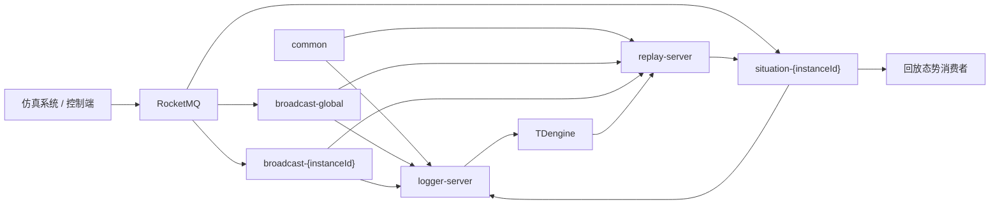
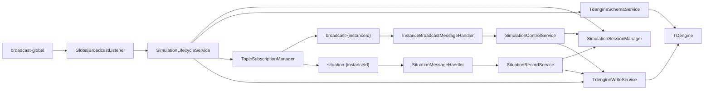
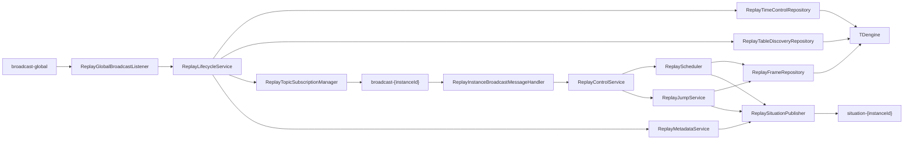

# logger-platform 架构说明

当前发布版本：`v0.2`

## 1. 系统定位

`logger-platform` 是一个面向仿真实例的记录与回放平台，负责把仿真运行期间的控制消息、态势消息沉淀到 TDengine，并在需要时基于已记录数据重新发布回放态势。

平台由三个 Maven 模块组成：

| 模块 | 类型 | 职责 |
| --- | --- | --- |
| `common` | 公共库 | 承载平台协议解析、JSON、Topic 命名、TDengine 命名、通用异常。 |
| `logger-server` | Spring Boot 服务 | 从 RocketMQ 消费仿真控制与态势消息，维护仿真会话和仿真时间，并写入 TDengine。 |
| `replay-server` | Spring Boot 服务 | 从 TDengine 查询已记录数据，按回放控制命令重新发布态势到 RocketMQ。 |

两个生产服务共享 `common`，但各自拥有独立的配置、状态机、消息入口、TDengine 访问逻辑和指标对象。

## 2. 技术栈

- Java 8
- Spring Boot 2.7.12
- RocketMQ Spring Boot Starter 2.2.3
- TDengine Java Connector 3.8.0
- Spring JDBC
- HikariCP
- Lombok
- JUnit 5 与 Mockito

## 3. 总体架构



设计边界：

- `logger-server` 是记录入口，消费原始态势并写入 TDengine。
- `replay-server` 是回放入口，只向 `situation-{instanceId}` 发布回放态势，不订阅该态势 Topic。
- 两个服务都固定订阅 `broadcast-global`，通过 `messageType` 区分记录任务与回放任务。
- 两个服务都会按实例动态订阅 `broadcast-{instanceId}`，但记录侧和回放侧的控制 `messageType` 不同。
- TDengine 是记录与回放之间的持久化边界，服务间不直接调用。

## 4. Topic 与协议隔离

### 4.1 Topic 约定

| Topic | 记录侧用途 | 回放侧用途 |
| --- | --- | --- |
| `broadcast-global` | 接收仿真实例创建与停止消息。 | 接收回放实例创建与停止消息。 |
| `broadcast-{instanceId}` | 接收指定仿真实例的启动、暂停、继续控制消息。 | 接收指定回放实例的启动、暂停、继续、倍速、跳转控制消息。 |
| `situation-{instanceId}` | 接收指定仿真实例的原始态势消息。 | 发布指定实例的回放态势消息。 |

Topic 名称由 `common` 模块的 `TopicConstants` 统一构造，`instanceId` 会先做非空校验和前后空白清理。

### 4.2 平台协议

协议解析由 `common` 模块的 `ProtocolMessageUtil` 负责。当前协议包使用小端序：

| 字段 | 长度 | 说明 |
| --- | --- | --- |
| `header` | 2 字节 | 固定 `0x90EB`。 |
| `senderId` | 4 字节 | 发送方标识。 |
| `messageType` | 2 字节 | 消息类型。 |
| `messageCode` | 4 字节 | 消息编号。 |
| `dataLength` | 4 字节 | 数据域长度。 |
| `rawData` | N 字节 | 原始载荷。 |
| `timestamp` | 8 字节 | 消息时间戳。 |
| `tail` | 2 字节 | 固定 `0x6F14`。 |

解析失败会抛出 `ProtocolParseException`。消息入口会记录结构化日志和指标，然后安全结束当前消息处理，避免监听线程因坏包退出。

### 4.3 消息类型配置

记录侧配置位于 `logger-server.protocol.messages`：

```yaml
logger-server:
  protocol:
    messages:
      global:
        message-type: 0
        create-message-code: 0
        stop-message-code: 1
      control:
        message-type: 1100
        start-message-code: 1
        pause-message-code: 5
        resume-message-code: 6
```

回放侧配置位于 `replay-server.protocol.messages`：

```yaml
replay-server:
  protocol:
    messages:
      global:
        message-type: 1
        create-message-code: 0
        stop-message-code: 1
      control:
        message-type: 1200
        start-message-code: 1
        pause-message-code: 2
        resume-message-code: 3
        rate-message-code: 4
        jump-message-code: 5
        metadata-message-code: 9
```

`broadcast-global` 同时承载记录任务和回放任务，必须依赖 `messageType` 隔离。`broadcast-{instanceId}` 同时承载记录控制和回放控制，也必须依赖实例级 `messageType` 隔离。

## 5. common 模块

`common` 是双服务共享的低层能力模块，不包含 Spring Boot 启动类。

| 包 | 职责 |
| --- | --- |
| `com.szzh.common.protocol` | 平台协议数据模型、解析和构包。 |
| `com.szzh.common.json` | Jackson JSON 工具。 |
| `com.szzh.common.topic` | `broadcast-global`、`broadcast-{instanceId}`、`situation-{instanceId}` 命名。 |
| `com.szzh.common.tdengine` | TDengine 超级表、子表、控制时间点表命名与标识符清洗。 |
| `com.szzh.common.exception` | 业务异常与协议解析异常。 |

该模块的核心原则是只沉淀跨服务稳定契约，避免把记录侧或回放侧业务状态机放入公共层。

## 6. logger-server 记录架构

### 6.1 包结构

| 包 | 职责 |
| --- | --- |
| `config` | 配置绑定、RocketMQ 动态消费者工厂、TDengine 数据源。 |
| `domain.clock` | 仿真时钟，支持启动、暂停、继续和倍率字段。 |
| `domain.session` | 仿真实例会话、状态机、会话注册表和运行计数。 |
| `model.dto` | 任务创建载荷、态势写入命令、控制时间点写入命令。 |
| `mq` | RocketMQ 全局监听、实例控制处理、态势处理、动态订阅管理。 |
| `service` | 生命周期、控制、态势记录、TDengine 建表和写入编排。 |
| `support.constant` | 记录侧消息常量与 TDengine SQL 模板。 |
| `support.metric` | 内存级记录侧指标。 |

### 6.2 记录链路



### 6.3 创建实例

1. `GlobalBroadcastListener` 从 `broadcast-global` 接收 RocketMQ `MessageExt`。
2. `ProtocolMessageUtil` 解析平台协议。
3. `MessageConstants` 判断是否为记录侧全局创建消息。
4. `SimulationLifecycleService.handleCreate` 解析 `TaskCreatePayload`。
5. `SimulationSessionManager` 创建或复用会话。
6. `TdengineSchemaService` 创建 `situation_{instanceId}` 超级表。
7. `TdengineSchemaService` 创建 `time_control_{instanceId}` 控制时间点表。
8. `TopicSubscriptionManager` 动态订阅 `broadcast-{instanceId}` 和 `situation-{instanceId}`。
9. 会话进入 `READY` 状态。

重复创建未停止实例会被识别为状态冲突，只记录指标和日志，不重复订阅。

### 6.4 控制消息

实例控制消息从 `broadcast-{instanceId}` 进入 `InstanceBroadcastMessageHandler`，再委派到 `SimulationControlService`。

| 当前状态 | 消息 | 结果 |
| --- | --- | --- |
| `READY` | `start` | 启动仿真时钟，进入 `RUNNING`，写入 `rate=1` 控制时间点。 |
| `RUNNING` | `pause` | 固化当前仿真时间，进入 `PAUSED`，写入 `rate=0` 控制时间点。 |
| `PAUSED` | `resume` | 恢复仿真时钟，进入 `RUNNING`，写入 `rate=1` 控制时间点。 |
| `PAUSED` | `start` | 复用继续逻辑，进入 `RUNNING`，写入 `rate=1` 控制时间点。 |
| 其他非法组合 | 任意控制消息 | 记录状态冲突并忽略。 |

控制时间点使用服务处理时刻写入 `ts`，使用当前仿真时钟写入 `simtime`。写入失败只打印日志，不回滚已经生效的控制状态。

### 6.5 态势写入

态势消息从 `situation-{instanceId}` 进入 `SituationMessageHandler`，再委派到 `SituationRecordService`。

处理规则：

- 会话不存在时，记录状态冲突并忽略。
- 会话不是 `RUNNING` 时，记录丢弃计数并忽略。
- 会话处于 `RUNNING` 时，构造 `SituationRecordCommand` 并调用 `TdengineWriteService.write`。
- 态势写入失败时，记录会话错误、TDengine 写入失败指标，并以 `BusinessException.Category.TDENGINE_WRITE` 向上暴露。

### 6.6 停止实例

停止消息仍从 `broadcast-global` 进入。`SimulationLifecycleService.handleStop` 会先写入 `rate=0` 的控制时间点，再取消动态订阅、停止会话、移除会话，并刷新活跃实例指标。

## 7. replay-server 回放架构

### 7.1 包结构

| 包 | 职责 |
| --- | --- |
| `config` | 回放配置绑定、RocketMQ 消费者工厂、生产者配置、TDengine 数据源。 |
| `domain.clock` | 回放时钟，支持开始、暂停、继续、倍速、跳转。 |
| `domain.session` | 回放会话、状态机、回放水位和子表分类结果。 |
| `model.dto` | 回放创建、元信息、倍速、跳转载荷。 |
| `model.query` | 查询游标、回放帧、表描述、表类型、时间范围。 |
| `mq` | 回放全局监听、实例控制处理、动态订阅、态势发布。 |
| `repository` | TDengine 时间范围、子表发现、帧查询。 |
| `service` | 回放生命周期、控制、调度、跳转、元信息、表分类、帧归并。 |
| `support.constant` | 回放侧消息常量。 |
| `support.metric` | 内存级回放侧指标。 |

### 7.2 回放链路



### 7.3 创建回放

1. `ReplayGlobalBroadcastListener` 从 `broadcast-global` 接收回放任务创建消息。
2. `ReplayLifecycleService.handleCreate` 解析 `ReplayCreatePayload`。
3. `ReplayTimeControlRepository` 读取 `time_control_{instanceId}`，计算回放起止时间。
4. `ReplayTableDiscoveryRepository` 基于 `situation_{instanceId}` 发现子表。
5. `ReplayTableClassifier` 按 `replay.event-messages` 区分事件表和周期表。
6. `ReplaySessionManager` 创建 `ReplaySession`，初始化时钟、水位、表分类和状态。
7. `ReplayTopicSubscriptionManager` 动态订阅 `broadcast-{instanceId}`。
8. `ReplayMetadataService` 发布回放元信息。
9. 会话进入 `READY` 状态。

未发现可回放态势子表时，创建失败并抛出业务异常。创建失败会清理已建立的动态订阅并标记会话失败。

### 7.4 回放控制

实例级回放控制消息由 `ReplayInstanceBroadcastMessageHandler` 分发到 `ReplayControlService`。

| 当前状态 | 消息 | 结果 |
| --- | --- | --- |
| `READY` | `start` | 启动回放时钟并注册连续调度。 |
| `RUNNING` | `pause` | 暂停回放时钟并取消连续调度。 |
| `PAUSED` | `resume` | 恢复回放时钟并重新注册连续调度。 |
| `RUNNING` / `PAUSED` | `rate` | 更新回放倍率。 |
| `READY` / `RUNNING` / `PAUSED` / `COMPLETED` | `jump` | 执行时间跳转和补偿发布。 |
| 任意状态 | `stop` | 取消调度、取消动态订阅、停止并移除会话。 |

`metadata` 消息码属于回放侧保留消息码，实例控制入口收到后直接忽略，避免把回放服务自己发布的元信息误当成控制指令。

### 7.5 连续回放

`ReplayScheduler` 以固定 tick 推进运行中的回放会话：

- 使用 `ReplayClock.currentTime()` 得到当前回放时间。
- 使用 `(lastDispatchedSimTime, currentReplayTime]` 作为查询窗口。
- 对事件表和周期表分页查询，再由 `ReplayFrameMergeService` 按 `simtime` 归并。
- 调用 `ReplaySituationPublisher` 逐帧发布到 `situation-{instanceId}`。
- 仅在发布成功后推进 `lastDispatchedSimTime`。
- 到达结束时间后将会话标记为 `COMPLETED` 并取消调度。

发布批次由 `replay-server.replay.publish.batch-size` 控制。该配置是服务层分批语义，不是 RocketMQ 批量发送 API；调度器会在批次边界检查会话状态，停止或失败后不继续发布后续帧。

### 7.6 时间跳转

`ReplayJumpService` 在会话锁内执行跳转，保证跳转与连续调度互斥。

跳转补偿规则：

- 向前跳转：发布 `(currentTime, targetTime]` 内的事件帧。
- 向后跳转：发布 `[simulationStartTime, targetTime]` 内的事件帧。
- 周期表：发布目标时间前最后一帧快照。
- 补偿帧发布成功后才执行时钟跳转和水位同步。
- 如果补偿发布期间会话停止或失败，不伪装跳转成功。

跳转发布同样按 `replay-server.replay.publish.batch-size` 做服务层分批，并在批次边界检查状态。

## 8. TDengine 数据模型

### 8.1 态势超级表

每个仿真实例对应一张超级表：

```sql
CREATE STABLE IF NOT EXISTS situation_{instanceId}
(
  ts TIMESTAMP,
  simtime BIGINT,
  rawdata VARBINARY(8192)
)
TAGS (
  sender_id INT,
  msgtype INT,
  msgcode INT
);
```

子表命名：

```text
situation_{messageType}_{messageCode}_{senderId}_{instanceId}
```

实例 ID 会通过 `TdengineNaming.sanitizeIdentifier` 清洗，避免非法字符进入表名。

### 8.2 控制时间点表

每个仿真实例对应一张控制时间点表：

```sql
CREATE TABLE IF NOT EXISTS time_control_{instanceId}
(
  ts TIMESTAMP,
  simtime BIGINT,
  rate DOUBLE,
  sender_id INT,
  msgtype INT,
  msgcode INT
);
```

字段语义：

| 字段 | 写入方 | 语义 |
| --- | --- | --- |
| `ts` | `logger-server` | 服务处理控制消息时的 TDengine `NOW` 时间。 |
| `simtime` | `logger-server` | 控制消息生效时的仿真时间。 |
| `rate` | `logger-server` | `start`、`resume` 为 `1`，`pause`、`stop` 为 `0`。 |
| `sender_id` | `logger-server` | 控制消息协议中的发送方 ID。 |
| `msgtype` | `logger-server` | 控制消息协议中的消息类型。 |
| `msgcode` | `logger-server` | 控制消息协议中的消息编号。 |

`replay-server` 只读取这些数据，不负责修正或重写记录侧表。

## 9. 配置模型

### 9.1 logger-server 配置

源码维护两份配置：

| 文件 | 说明 |
| --- | --- |
| `logger-server/src/main/resources/application.yml` | 应用名、默认 profile、日志级别、记录侧协议消息码、会话和写入参数。 |
| `logger-server/src/main/resources/application-dev.yml` | RocketMQ nameserver、TDengine JDBC、消费者组前缀。 |

测试代码中仍有历史 `local` profile 和 `application-local.yml` 读取路径。为了不改测试源码，`logger-server/pom.xml` 在 `process-test-resources` 阶段把 `application-dev.yml` 复制为测试输出目录里的 `application-local.yml`。

### 9.2 replay-server 配置

源码维护两份主配置和两份测试配置：

| 文件 | 说明 |
| --- | --- |
| `replay-server/src/main/resources/application.yml` | 应用名、默认 profile、回放侧协议消息码、事件表配置、查询、调度、发布参数。 |
| `replay-server/src/main/resources/application-dev.yml` | RocketMQ nameserver、TDengine JDBC、消费者组前缀、生产者组。 |
| `replay-server/src/test/resources/application-test.yml` | 单元测试和 Mock 集成测试配置。 |
| `replay-server/src/test/resources/application-real.yml` | 真实环境测试补充配置。 |

关键回放参数：

| 配置 | 说明 |
| --- | --- |
| `replay-server.replay.event-messages` | 被视为事件表的 `messageType/messageCode` 白名单；未命中的子表按周期表处理。 |
| `replay-server.replay.query.page-size` | TDengine 分页查询大小。 |
| `replay-server.replay.scheduler.tick-millis` | 连续回放调度间隔。 |
| `replay-server.replay.publish.batch-size` | 服务层发布批次大小。 |
| `replay-server.replay.publish.retry-times` | 单帧发布重试次数。 |

## 10. 异常、日志与指标

异常处理原则是入口不崩溃、业务错误可定位、真实写入和发布失败不静默。

| 类别 | 处理方式 |
| --- | --- |
| 协议解析错误 | 记录 warn 日志和解析失败指标，当前消息结束。 |
| 状态非法或会话缺失 | 记录状态冲突指标，忽略非法控制。 |
| 记录侧态势写入失败 | 标记会话错误，记录 TDengine 写入失败指标，并向上抛出业务异常。 |
| 记录侧控制时间点写入失败 | 只记录错误日志，不阻断已生效控制流程。 |
| 回放侧查询失败 | 记录查询失败指标，相关会话进入失败或中断路径。 |
| 回放侧发布失败 | 记录发布失败指标，连续调度不推进未成功发布后的水位。 |
| 动态订阅启动失败 | 关闭已创建消费者句柄，清理会话句柄并抛出初始化异常。 |

`LoggerMetrics` 和 `ReplayMetrics` 当前均为内存级计数器，尚未接入外部指标系统。

## 11. 并发与一致性

记录侧一致性：

- `SimulationSessionManager` 使用 `ConcurrentHashMap` 管理会话。
- 单个 `SimulationSession` 的状态迁移由同步块保护。
- `TopicSubscriptionManager` 使用同步方法控制动态订阅新增和取消。
- 容器销毁时关闭全部动态消费者。
- TDengine 数据源使用 HikariCP，初始化失败超时设置为 `-1`，允许应用在数据库暂不可达时完成启动。

回放侧一致性：

- `ReplaySessionManager` 管理回放会话。
- `ReplayScheduler` 在会话对象锁内执行 tick。
- `ReplayJumpService` 在同一会话对象锁内执行跳转，避免与连续调度并发推进。
- 连续回放只有发布成功后才推进 `lastDispatchedSimTime`。
- 分批发布在批次边界检查状态，避免停止或失败后继续发布。
- 停止回放会取消调度、取消动态订阅并移除会话。

## 12. 测试策略

默认测试层级：

- `common` 协议、JSON、Topic、TDengine 命名单元测试。
- `logger-server` 仿真时钟、会话状态、消息分发、TDengine SQL、生命周期、控制和态势记录测试。
- `logger-server` Mock 主流程集成测试。
- `replay-server` 回放时钟、会话状态、消息分发、TDengine 查询、表分类、连续调度、倍速、跳转和发布测试。
- `replay-server` Mock 全链路集成测试。
- Spring 容器级 Mock 集成测试。

常规验证命令：

```powershell
mvn test
mvn package
mvn -pl logger-server -am test
mvn -pl replay-server -am test
```

真实环境测试默认跳过，需要显式系统属性开启：

```powershell
mvn -pl logger-server -am "-Dtest=RealEnvironmentFullFlowTest" "-Dlogger.real-env.test=true" -DfailIfNoTests=false test
mvn -pl replay-server -am "-Dtest=ReplayRealEnvironmentTest" "-Dreplay.real-env.test=true" -DfailIfNoTests=false test
```

真实环境验证依赖当前 YAML 中配置的 RocketMQ 与 TDengine。排查真实环境问题时，需要区分 TCP 连通、broker 路由可用、Spring Boot 自动监听链路可用和 TDengine SQL 可执行这几类边界。

## 13. v0.2 当前范围

`v0.2` 是记录与回放双服务发布版本，当前范围如下。

已包含：

- Maven 多模块父工程。
- `common` 公共协议与命名模块。
- `logger-server` 全局订阅、动态订阅、生命周期、控制、态势记录。
- `logger-server` 控制时间点表创建和 `start`、`pause`、`resume`、`stop` 写入。
- `replay-server` 全局订阅、动态控制订阅、TDengine 元数据读取、表分类。
- `replay-server` 连续回放、暂停继续、倍速控制、时间跳转、元信息发布。
- `replay-server.replay.publish.batch-size` 服务层分批发布。
- 记录侧与回放侧实例控制配置均使用 `protocol.messages.control` 节点。
- 默认自动化测试和显式真实环境测试入口。
- 结构化日志和内存级指标。

暂未包含：

- HTTP 管理接口。
- 外部可观测性系统集成。
- 记录侧动态倍率控制入口。
- 消息幂等写入去重。
- 分布式多节点会话协调。
- 多 `replayInstanceId` 并发复用同一个记录实例的调度隔离。
- Redis 或其他外部缓存。
- 同一毫秒内跨表严格全序还原。
