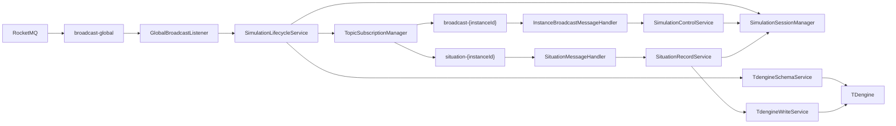

# logger-server 架构说明

## 1. 系统定位

`logger-server` 是一个面向仿真实例的数据记录服务。服务固定监听全局广播主题 `broadcast-global`，根据任务创建消息为每个仿真实例动态订阅控制主题 `broadcast-{instanceId}` 与态势主题 `situation-{instanceId}`，并将运行态势消息写入 TDengine。

v0.1 的核心目标是完成从 RocketMQ 消息接入、协议解析、会话状态管理、仿真时钟维护到 TDengine 落库的端到端闭环。

## 2. 技术栈

- Java 8
- Spring Boot 2.7.12
- RocketMQ Spring Boot Starter 2.2.3
- TDengine Java Connector 3.8.0
- Spring JDBC
- HikariCP
- Lombok
- JUnit 5 与 Mockito

## 3. 总体架构



架构按职责分为四层：

- 消息接入层：`GlobalBroadcastListener`、`TopicSubscriptionManager`、`InstanceBroadcastMessageHandler`、`SituationMessageHandler`。
- 应用服务层：`SimulationLifecycleService`、`SimulationControlService`、`SituationRecordService`。
- 领域层：`SimulationSessionManager`、`SimulationSession`、`SimulationClock`、`SimulationSessionState`。
- 基础设施层：`RocketMqConsumerFactory`、`TdengineConfig`、`TdengineSchemaService`、`TdengineWriteService`。

## 4. 包结构

| 包 | 职责 |
| --- | --- |
| `config` | 绑定应用配置，创建 RocketMQ 动态消费者与 TDengine 数据源。 |
| `domain.clock` | 仿真时钟，支持启动、暂停、继续和倍率调整。 |
| `domain.session` | 仿真实例会话、状态机、会话注册表和运行计数。 |
| `model.dto` | 跨层传递的数据对象，包括任务创建载荷和 TDengine 写入命令。 |
| `mq` | RocketMQ 消息入口、动态订阅管理和端口接口。 |
| `service` | 生命周期、实例控制、态势记录、TDengine 建表和写入编排。 |
| `support.constant` | Topic、消息码、TDengine 命名与 SQL 模板。 |
| `support.exception` | 业务异常与协议解析异常。 |
| `support.metric` | 内存级运行指标计数。 |
| `util` | 平台协议解析、JSON 工具和协议数据模型。 |

## 5. 消息与协议

### 5.1 Topic 约定

| Topic | 来源 | 用途 |
| --- | --- | --- |
| `broadcast-global` | 固定订阅 | 接收任务创建与任务停止消息。 |
| `broadcast-{instanceId}` | 动态订阅 | 接收指定实例的启动、暂停、继续控制消息。 |
| `situation-{instanceId}` | 动态订阅 | 接收指定实例的态势数据消息。 |

实例 topic 由 `TopicConstants` 统一构造，`instanceId` 会先执行非空校验和前后空白清理。

### 5.2 平台协议

协议解析由 `ProtocolMessageUtil` 负责。当前协议包使用小端序，结构如下：

| 字段 | 长度 | 说明 |
| --- | --- | --- |
| header | 2 字节 | 固定 `0x90EB`。 |
| senderId | 4 字节 | 发送方标识。 |
| messageType | 2 字节 | 消息类型。 |
| messageCode | 4 字节 | 消息编号。 |
| dataLength | 4 字节 | 数据域长度。 |
| rawData | N 字节 | 原始载荷。 |
| timestamp | 8 字节 | 消息时间戳。 |
| tail | 2 字节 | 固定 `0x6F14`。 |

解析失败会抛出 `ProtocolParseException`，消息入口会记录解析失败指标并安全吞掉该消息，避免监听线程因坏包退出。

### 5.3 消息码配置

全局消息与实例控制消息不再硬编码在业务分发逻辑中，而是从 `logger-server.protocol.messages` 绑定到 `MessageConstants`：

```yaml
logger-server:
  protocol:
    messages:
      global:
        message-type: 0
        create-message-code: 0
        stop-message-code: 1
      instance:
        message-type: 1100
        start-message-code: 1
        pause-message-code: 5
        resume-message-code: 6
```

## 6. 生命周期链路

### 6.1 创建实例

1. `GlobalBroadcastListener` 从 `broadcast-global` 接收 `MessageExt` 原始消息。
2. `ProtocolMessageUtil` 解析协议包。
3. `MessageConstants` 判断是否为全局生命周期消息。
4. 创建消息被委派到 `SimulationLifecycleService.handleCreate`。
5. `TaskCreatePayload` 从消息载荷中提取 `instanceId`。
6. `SimulationSessionManager` 创建或复用会话。
7. `TdengineSchemaService` 创建实例超级表。
8. `TopicSubscriptionManager` 为实例启动控制消费者和态势消费者。
9. 会话进入 `READY` 状态。

重复创建未停止的实例会被识别为状态冲突，只记录指标和日志，不重复订阅。

### 6.2 启动、暂停、继续

实例控制消息从 `broadcast-{instanceId}` 进入 `InstanceBroadcastMessageHandler`，再按配置化的消息码委派到 `SimulationControlService`。

状态迁移规则：

| 当前状态 | 消息 | 结果 |
| --- | --- | --- |
| `READY` | start | 启动仿真时钟，进入 `RUNNING`。 |
| `RUNNING` | pause | 固化当前仿真时间，进入 `PAUSED`。 |
| `PAUSED` | resume | 恢复仿真时钟，进入 `RUNNING`。 |
| `PAUSED` | start | 复用继续逻辑，进入 `RUNNING`。 |
| 其他非法组合 | 任意控制消息 | 记录状态冲突并忽略。 |

`SimulationClock` 以系统时间为基准维护仿真时间，当前已支持倍率字段和 `updateSpeed`，v0.1 主流程只使用默认 `1.0` 倍速。

### 6.3 态势写入

态势消息从 `situation-{instanceId}` 进入 `SituationMessageHandler`，再委派到 `SituationRecordService`。

处理规则：

- 会话不存在时，记录状态冲突并忽略。
- 会话不是 `RUNNING` 时，记录丢弃计数并忽略。
- 会话处于 `RUNNING` 时，构造 `SituationRecordCommand` 并调用 `TdengineWriteService.write`。
- 写入失败时，记录会话错误、TDengine 写入失败指标，并统一包装为 `BusinessException.Category.TDENGINE_WRITE`。

### 6.4 停止实例

停止消息仍从 `broadcast-global` 进入。`SimulationLifecycleService.handleStop` 会取消实例动态订阅、停止会话、移除会话，并刷新活跃实例指标。

## 7. TDengine 数据模型

每个仿真实例对应一张超级表：

```sql
CREATE STABLE IF NOT EXISTS situation_{instanceId}
(
  ts TIMESTAMP,
  simtime BIGINT,
  rawdata VARBINARY(8192)
)
TAGS (
  sender_id INT,
  msgtype INT,
  msgcode INT
)
```

每类消息维度写入对应子表：

```text
situation_{messageType}_{messageCode}_{senderId}_{instanceId}
```

命名由 `TdengineConstants` 统一生成。实例 ID 会清洗为 TDengine 可接受的标识符，避免非法字符进入表名。

v0.1 默认使用标准 JDBC `INSERT INTO ... USING ... TAGS ... VALUES ...` 写入单条态势记录，同时保留 `TSWSPreparedStatement` 批量写入方法作为后续扩展点。

## 8. 配置模型

源码只维护两份配置文件：

| 文件 | 说明 |
| --- | --- |
| `application.yml` | 应用名、默认 profile、日志级别、协议消息码、会话与写入通用参数。 |
| `application-dev.yml` | RocketMQ nameserver、TDengine JDBC、消费者组前缀等开发环境配置。 |

测试代码中仍有历史 `local` profile 和 `application-local.yml` 读取路径。为了不改测试源码，`pom.xml` 在 `process-test-resources` 阶段把 `application-dev.yml` 复制为测试输出目录里的 `application-local.yml`，该文件不作为源码配置维护。

关键配置项：

| 配置 | 说明 |
| --- | --- |
| `rocketmq.name-server` | RocketMQ nameserver 地址。 |
| `logger-server.tdengine.jdbc-url` | TDengine WebSocket JDBC 地址。 |
| `logger-server.tdengine.username` | TDengine 用户名。 |
| `logger-server.tdengine.password` | TDengine 密码。 |
| `logger-server.rocketmq.global-consumer-group` | 全局广播监听消费组。 |
| `logger-server.rocketmq.instance-consumer-group-prefix` | 实例动态消费者组前缀。 |
| `logger-server.protocol.messages.*` | 全局与实例控制消息的类型和消息码。 |
| `logger-server.write.retry-times` | 单条写入失败重试次数。 |

## 9. 异常、日志与指标

异常分类以入口不崩溃、业务错误可定位为原则：

- 协议解析错误：记录协议失败指标和 warn 日志，当前消息消费结束。
- 状态非法或会话缺失：记录状态冲突指标和 info/debug 日志。
- TDengine 写入失败：记录错误指标和 error 日志，并以业务异常向上暴露。
- 动态订阅启动失败：关闭已创建消费者句柄，清理会话句柄并抛出初始化异常。

`LoggerMetrics` 当前为内存级计数器，覆盖协议解析失败、TDengine 写入失败、状态冲突、消息接收、写入、丢弃和活跃实例数量。v0.1 尚未接入外部指标系统。

## 10. 并发与资源管理

- `SimulationSessionManager` 使用 `ConcurrentHashMap` 管理会话。
- 单个会话的状态迁移使用 `synchronized` 保护。
- 动态订阅的新增与取消在 `TopicSubscriptionManager` 中使用同步方法控制。
- `TopicSubscriptionManager` 实现 `DisposableBean`，容器销毁时关闭全部动态消费者。
- TDengine 数据源使用 HikariCP，初始化失败超时设置为 `-1`，允许应用在数据库暂不可达时完成启动。

## 11. 测试策略

v0.1 覆盖以下测试层级：

- 协议解析和 JSON 工具单元测试。
- 会话、仿真时钟和领域状态测试。
- TDengine SQL 命名、建表、写入重试测试。
- RocketMQ 动态订阅和监听器签名测试。
- 生命周期、控制服务、态势记录服务测试。
- 创建、启动、暂停、继续、停止、态势写入的主流程集成测试。
- 可选真实环境完整测试，通过系统属性 `logger.real-env.test=true` 启用。

常规验证命令：

```powershell
mvn -q test
mvn -q package
```

## 12. v0.1 范围

已包含：

- 固定监听 `broadcast-global`。
- 动态订阅 `broadcast-{instanceId}` 与 `situation-{instanceId}`。
- 实例创建、启动、暂停、继续、停止。
- 仿真时间维护与态势消息按仿真时间写入。
- TDengine 超级表和子表命名规则。
- 协议消息码配置外置。
- 两份 YAML 配置模型。
- 单元测试、集成测试和可选真实环境测试。

暂未包含：

- HTTP 管理接口。
- 外部可观测性系统集成。
- 消息幂等写入去重。
- 分布式多节点会话协调。
- 控制消息扩展到动态倍率变更的完整业务入口。
