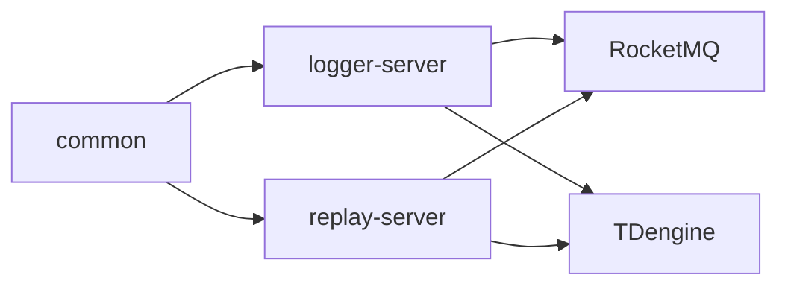

# 回放系统详细技术方案

## 1. 文档目标

本文档基于 `005-draft.md`、现有 `logger-server` 记录系统实现、`ARCHITECTURE.md`、`plan/004-记录仿真控制指令时间点/final.md` 以及本轮讨论结论，给出回放系统的可实施技术方案。

本文档重点回答以下问题：

- 回放系统与记录系统如何拆分，并在生产环境形成两个独立服务。
- 回放系统如何接收任务管理消息与实例级回放控制消息。
- 回放系统如何从 TDengine 读取已记录的态势数据与控制时间点。
- 回放系统如何区分事件类表与周期类表。
- 回放开始、暂停、继续、倍速、时间跳转分别如何处理。
- 第一版为什么不引入 Redis，以及后续什么条件下再考虑缓存。
- 后续编码落地时如何组织模块、测试和验收。

## 2. 已确认设计决策

### 2.1 服务拆分

最终拆分为三个模块：

```text
common
logger-server
replay-server
```

生产环境部署两个服务：

```text
logger-server
replay-server
```

`common` 只作为代码复用模块，不独立部署。

### 2.2 `instanceId` 口径

第一版暂不拆分“原始记录实例 ID”和“回放实例 ID”，统一使用同一个 `instanceId`。

这意味着第一版默认不支持同一个 `instanceId` 在同一时间既处于记录状态又处于回放状态。正常使用流程应为：

1. `logger-server` 对某个 `instanceId` 完成记录。
2. 记录任务停止，`logger-server` 取消该实例的态势 topic 订阅。
3. `replay-server` 使用同一个 `instanceId` 回放已记录数据。

后续如果需要同一份数据同时开启多个回放任务，应扩展为：

```json
{
  "sourceInstanceId": "原始记录实例 ID",
  "replayInstanceId": "回放任务实例 ID"
}
```

第一版不实现该扩展。

### 2.3 回放订阅职责

回放系统只订阅：

- `broadcast-global`
- `broadcast-{instanceId}`

回放系统不订阅：

- `situation-{instanceId}`

回放系统会向 `situation-{instanceId}` 发布回放出来的态势数据，但不会消费该 topic。

停止回放任务时，应停止回放调度并取消订阅 `broadcast-{instanceId}`。草案中“停止订阅 `situation-{instanceId}`”是错误描述，本方案修正为“停止订阅 `broadcast-{instanceId}`”。

### 2.4 时间跳转职责边界

时间跳转时，回放系统只负责按规则把数据发布到 `situation-{instanceId}`。

回放系统不发布“状态重置协议”，也不负责通知下游清空状态。下游状态重置由外部服务控制。

### 2.5 停止控制时间点

回放系统需要依赖 `time_control_{instanceId}` 获取仿真开始时间、暂停时间、继续时间、倍速变化时间和仿真结束时间。

现有记录系统此前未在任务停止时记录控制时间点。该问题需要在记录系统中修复：任务停止实际生效时，应向 `time_control_{instanceId}` 写入一条控制时间点。

本方案按停止控制点已经补齐进行设计，同时给出兼容降级策略：如果历史数据缺少停止控制点，则从态势超级表中查询 `MAX(simtime)` 作为结束时间。

### 2.6 回放时钟

回放系统新增独立 `ReplayClock`。

不硬改现有 `SimulationClock`，原因是记录系统的时钟从当前墙钟时间启动，而回放时钟必须支持：

- 从指定仿真开始时间启动。
- 暂停时冻结当前回放仿真时间。
- 继续时从冻结点继续推进。
- 倍速推进。
- 直接跳转到指定仿真时间。
- 限制在 `[startTime, endTime]` 范围内。

### 2.7 Redis 策略

第一版不引入 Redis。

原因如下：

- 回放必须发布的数据量不会因为 Redis 缓存而减少。
- 时间跳转的核心成本在于事件数据补发和周期表最后一帧查询。
- Redis 会引入双存储一致性、缓存失效、内存容量和部署复杂度。
- 第一版更适合先用 TDengine 分页查询、内存游标和批量发布实现闭环，再根据真实压测结果决定是否引入缓存。

### 2.8 表分类策略

表分类不解析表名。

回放系统通过 TDengine 子表 tag 元数据识别每张子表的：

- `sender_id`
- `msgtype`
- `msgcode`

再根据 YAML 中配置的事件消息类型与消息编号判断事件类表。未命中事件配置的表统一视为周期类表。

## 3. 总体架构

### 3.1 模块关系



### 3.2 `common` 职责

`common` 放置记录系统与回放系统共同依赖的纯公共能力：

- 协议对象 `ProtocolData`
- 协议解析与构包工具 `ProtocolMessageUtil`
- JSON 工具
- Topic 命名工具
- TDengine 标识清洗和表名构造规则
- 通用异常类型
- 通用 DTO 基础对象
- 通用测试辅助工具

`common` 不应包含：

- 记录业务服务。
- 回放业务服务。
- Spring Boot 启动类。
- 具体消费者订阅编排。
- 具体 TDengine 写入或查询业务流程。

### 3.3 `logger-server` 职责

`logger-server` 继续负责记录：

- 订阅 `broadcast-global` 中的记录任务管理消息。
- 动态订阅 `broadcast-{instanceId}` 与 `situation-{instanceId}`。
- 维护记录侧 `SimulationSession` 与 `SimulationClock`。
- 将态势数据写入 TDengine。
- 将开始、暂停、继续、停止等控制时间点写入 `time_control_{instanceId}`。

### 3.4 `replay-server` 职责

`replay-server` 负责回放：

- 订阅 `broadcast-global` 中的回放任务管理消息。
- 动态订阅 `broadcast-{instanceId}` 回放控制消息。
- 从 TDengine 读取 `situation_{instanceId}` 与 `time_control_{instanceId}`。
- 维护回放侧 `ReplaySession` 与 `ReplayClock`。
- 按回放时钟向 `situation-{instanceId}` 发布态势协议包。
- 处理暂停、继续、倍速和时间跳转。

`replay-server` 不负责：

- 写入态势记录。
- 消费 `situation-{instanceId}`。
- 控制下游状态重置。
- 修复历史记录数据。

## 4. 消息与 Topic 设计

### 4.1 Topic 列表

| Topic | 回放系统角色 | 用途 |
| --- | --- | --- |
| `broadcast-global` | 固定订阅 | 接收回放任务创建和停止消息。 |
| `broadcast-{instanceId}` | 动态订阅 | 接收指定实例的回放开始、暂停、继续、倍速、时间跳转消息。 |
| `situation-{instanceId}` | 只发布不订阅 | 发布回放出来的态势数据。 |

### 4.2 全局回放任务管理消息

回放任务管理消息来自 `broadcast-global`。

协议解析仍使用：

```java
ProtocolMessageUtil.parseData(byte[] rawData)
```

解析后得到：

```java
public class ProtocolData {
    private int senderId;
    private int messageType;
    private int messageCode;
    private byte[] rawData;
}
```

回放全局消息建议使用独立消息类型，避免与记录系统全局任务管理消息冲突。

| 字段 | 值 | 说明 |
| --- | --- | --- |
| `messageType` | `1` | 回放任务管理消息类型。 |
| `messageCode` | `0` | 创建回放任务。 |
| `messageCode` | `1` | 停止回放任务。 |

记录系统当前全局任务管理消息类型为 `0`，回放系统使用 `1` 后，两个服务可以同时订阅 `broadcast-global`，并通过 `messageType` 各自过滤。

### 4.3 创建回放任务 payload

第一版 payload：

```json
{
  "instanceId": "instance-001"
}
```

字段说明：

| 字段 | 类型 | 说明 |
| --- | --- | --- |
| `instanceId` | `String` | 全局唯一实例 ID，同时用于定位 TDengine 记录表、订阅回放控制 topic、发布态势 topic。 |

第一版不支持 `sourceInstanceId` 与 `replayInstanceId` 分离。

### 4.4 停止回放任务 payload

停止消息沿用创建消息 payload：

```json
{
  "instanceId": "instance-001"
}
```

停止时处理：

1. 停止该实例的回放调度线程。
2. 取消订阅 `broadcast-{instanceId}`。
3. 移除 `ReplaySession`。
4. 不处理 `situation-{instanceId}` 订阅，因为回放系统从未订阅该 topic。

### 4.5 实例级回放控制消息

实例级控制消息来自 `broadcast-{instanceId}`。

| 字段 | 值 | 说明 |
| --- | --- | --- |
| `messageType` | `1200` | 回放控制消息类型。 |
| `messageCode` | `1` | 启动回放。 |
| `messageCode` | `2` | 暂停回放。 |
| `messageCode` | `3` | 继续回放。 |
| `messageCode` | `4` | 倍速回放。 |
| `messageCode` | `5` | 时间跳转。 |
| `messageCode` | `9` | 回放元信息通知，由回放系统发布，回放控制处理器忽略。 |

### 4.6 倍速回放 payload

```json
{
  "rate": 2.0
}
```

规则：

- `rate > 0`。
- `rate = 1` 表示正常速度。
- `rate = 2` 表示二倍速。
- `rate = 0.5` 表示半速。
- `rate = 0` 不通过倍速消息表达，暂停应使用 `messageCode=2`。

### 4.7 时间跳转 payload

```json
{
  "time": 1713952800000
}
```

规则：

- `time` 为目标仿真时间点，使用 Java `long` 毫秒值。
- 回放系统会将目标时间限制在 `[simulationStartTime, simulationEndTime]` 范围内。

### 4.8 回放元信息通知

创建回放任务完成准备工作后，回放系统向 `broadcast-{instanceId}` 发布一条元信息通知。

| 字段 | 值 |
| --- | --- |
| `messageType` | `1200` |
| `messageCode` | `9` |

payload：

```json
{
  "startTime": 1713952800000,
  "endTime": 1713956400000,
  "duration": 3600000
}
```

说明：

- 该消息供外部 UI 或控制服务感知回放时间范围。
- `replay-server` 自己的控制处理器应忽略 `messageCode=9`。
- 若同一 topic 中存在多个消费者，该消息不应触发回放状态变化。

## 5. TDengine 数据读取设计

### 5.1 已有记录表结构

记录系统按实例创建超级表：

```sql
CREATE STABLE IF NOT EXISTS situation_{instanceId}
(
  ts TIMESTAMP,
  simtime BIGINT,
  rawdata VARBINARY(8192)
)
TAGS (
  sender_id INT,
  msgtype INT,
  msgcode INT
)
```

子表命名规则：

```text
situation_{messageType}_{messageCode}_{senderId}_{instanceId}
```

控制时间点表：

```sql
CREATE TABLE IF NOT EXISTS time_control_{instanceId} (
    ts TIMESTAMP,
    simtime BIGINT,
    rate DOUBLE,
    sender_id INT,
    msgtype INT,
    msgcode INT
)
```

### 5.2 回放数据来源

回放系统读取两类数据：

| 数据 | 表 | 用途 |
| --- | --- | --- |
| 态势数据 | `situation_{instanceId}` 及其子表 | 按仿真时间发布到 `situation-{instanceId}`。 |
| 控制时间点 | `time_control_{instanceId}` | 计算仿真开始时间、结束时间、持续时间，并为未来按原控制节奏回放预留。 |

### 5.3 不依赖 `ts` 作为回放时间

回放时间统一使用 `simtime` 字段。

原因：

- 记录系统标准单条写入路径中 `ts` 是服务写入时间。
- 回放业务语义需要按仿真时间推进。
- `time_control_{instanceId}` 的关键字段也是 `simtime` 与 `rate`。

因此所有回放窗口查询、跳转查询和结束时间推导均以 `simtime` 为准。

### 5.4 子表元数据发现

回放任务创建时，回放系统需要发现该实例下所有态势子表。

推荐查询 TDengine 元数据表：

```sql
SELECT table_name, tag_name, tag_type, tag_value
FROM information_schema.ins_tags
WHERE stable_name = ?
```

其中 `stable_name` 为：

```text
situation_{sanitizedInstanceId}
```

查询结果按 `table_name` 聚合，得到每张子表的：

- `tableName`
- `senderId`
- `messageType`
- `messageCode`

如果实际 TDengine 版本对 `stable_name` 需要数据库限定，则查询实现应在 `ReplayTableDiscoveryRepository` 内适配，不把 SQL 细节泄漏到业务层。

### 5.5 表类型分类

回放系统配置事件类消息：

```yaml
replay-server:
  protocol:
    messages:
      global:
        message-type: 1
        create-message-code: 0
        stop-message-code: 1
      control:
        message-type: 1200
        start-message-code: 1
        pause-message-code: 2
        resume-message-code: 3
        rate-message-code: 4
        jump-message-code: 5
        metadata-message-code: 9
  replay:
    event-messages:
      - message-type: 1001
        message-codes: [1, 2, 3]
      - message-type: 1002
        message-codes: [8]
    query:
      page-size: 1000
    scheduler:
      tick-millis: 50
    publish:
      batch-size: 500
      retry-times: 3
```

分类规则：

1. 读取子表 tag 元数据。
2. 用 `messageType + messageCode` 匹配 `replay-server.replay.event-messages`。
3. 命中则为事件类表。
4. 未命中则为周期类表。

分类结果在 `ReplaySession` 中保存，避免运行期反复查元数据。

### 5.6 仿真开始时间

优先从 `time_control_{instanceId}` 查询第一条运行态控制点：

```sql
SELECT simtime
FROM time_control_{instanceId}
WHERE rate > 0
ORDER BY simtime ASC
LIMIT 1
```

如果没有控制点，则降级从态势数据查询：

```sql
SELECT MIN(simtime)
FROM situation_{instanceId}
```

如果两者都查不到，说明该实例没有可回放数据，创建回放任务失败。

### 5.7 仿真结束时间

优先从 `time_control_{instanceId}` 查询停止控制点。

记录系统修复后，任务停止时应写入一条 `rate=0` 的控制时间点，并且 `msgcode` 为全局停止消息码或明确的停止控制消息码。回放系统可以通过配置识别停止控制点。

推荐查询逻辑：

```sql
SELECT simtime
FROM time_control_{instanceId}
WHERE msgtype = ? AND msgcode = ?
ORDER BY simtime DESC
LIMIT 1
```

如果历史数据缺少停止控制点，则降级：

```sql
SELECT MAX(simtime)
FROM situation_{instanceId}
```

最终计算：

```text
duration = simulationEndTime - simulationStartTime
```

如果 `duration < 0`，创建回放任务失败并记录数据异常。

## 6. 回放领域模型

### 6.1 `ReplaySession`

每个 `instanceId` 对应一个 `ReplaySession`。

建议字段：

```java
/**
 * 回放会话。
 */
public class ReplaySession {
    private final String instanceId;
    private final long simulationStartTime;
    private final long simulationEndTime;
    private final ReplayClock replayClock;
    private final List<ReplayTableDescriptor> eventTables;
    private final List<ReplayTableDescriptor> periodicTables;
    private final Map<String, ReplayCursor> cursors;
    private volatile ReplaySessionState state;
    private volatile double rate;
    private volatile long lastDispatchedSimTime;
    private volatile Object broadcastConsumerHandle;
}
```

说明：

- `eventTables` 保存事件类表。
- `periodicTables` 保存周期类表。
- `cursors` 保存连续回放时每张表的分页游标。
- `lastDispatchedSimTime` 表示已经成功发布到 RocketMQ 的最大仿真时间水位。

### 6.2 `ReplaySessionState`

建议状态：

| 状态 | 说明 |
| --- | --- |
| `PREPARING` | 已收到创建消息，正在读取元数据和初始化资源。 |
| `READY` | 回放任务已准备完成，等待启动。 |
| `RUNNING` | 回放时钟推进中，调度器持续发布数据。 |
| `PAUSED` | 回放暂停，时钟不推进。 |
| `STOPPED` | 回放已停止，资源已释放。 |
| `COMPLETED` | 已自然回放到结束时间。 |
| `FAILED` | 初始化或运行过程中发生不可恢复异常。 |

### 6.3 状态迁移

| 当前状态 | 输入 | 目标状态 |
| --- | --- | --- |
| 无会话 | 创建任务 | `PREPARING -> READY` |
| `READY` | 启动回放 | `RUNNING` |
| `RUNNING` | 暂停回放 | `PAUSED` |
| `PAUSED` | 继续回放 | `RUNNING` |
| `RUNNING/PAUSED/READY` | 停止任务 | `STOPPED` |
| `RUNNING/PAUSED` | 时间跳转 | 状态保持，时钟同步到目标时间 |
| `RUNNING` | 到达结束时间 | `COMPLETED` |
| 任意非终态 | 不可恢复错误 | `FAILED` |

### 6.4 幂等规则

- 重复创建：如果同一 `instanceId` 已存在非终态回放会话，则忽略。
- 重复启动：如果已是 `RUNNING`，忽略。
- 重复暂停：如果已是 `PAUSED`，忽略。
- 重复继续：如果已是 `RUNNING`，忽略。
- 重复停止：如果会话不存在或已终止，安全返回。
- 倍速消息：仅在 `RUNNING` 或 `PAUSED` 下接受，其他状态忽略。
- 时间跳转：仅在 `READY`、`RUNNING`、`PAUSED`、`COMPLETED` 下接受，终态下忽略。

## 7. `ReplayClock` 设计

### 7.1 字段设计

```java
/**
 * 回放时钟。
 */
public class ReplayClock {
    private final LongSupplier wallClockSupplier;
    private final long startTime;
    private final long endTime;
    private long baseReplayTime;
    private long baseWallClockTime;
    private double rate;
    private boolean running;
}
```

### 7.2 核心方法

```java
/**
 * 从仿真开始时间启动回放。
 */
public synchronized void start();

/**
 * 暂停回放时钟。
 */
public synchronized void pause();

/**
 * 继续回放时钟。
 */
public synchronized void resume();

/**
 * 更新回放倍率。
 *
 * @param newRate 新倍率。
 */
public synchronized void updateRate(double newRate);

/**
 * 跳转到指定仿真时间。
 *
 * @param targetTime 目标仿真时间。
 * @return 被边界限制后的实际时间。
 */
public synchronized long jumpTo(long targetTime);

/**
 * 获取当前回放仿真时间。
 *
 * @return 当前回放仿真时间。
 */
public synchronized long currentTime();
```

### 7.3 时间计算公式

运行中：

```text
currentTime = baseReplayTime + (nowWallClock - baseWallClockTime) * rate
```

暂停中：

```text
currentTime = baseReplayTime
```

边界限制：

```text
currentTime = min(max(currentTime, startTime), endTime)
```

### 7.4 与 `SimulationClock` 的差异

| 能力 | `SimulationClock` | `ReplayClock` |
| --- | --- | --- |
| 起始时间 | 当前系统时间 | 已记录仿真开始时间 |
| 跳转 | 不支持 | 支持 |
| 结束边界 | 不支持 | 支持 |
| 暂停 | 支持 | 支持 |
| 倍速 | 已有基础能力 | 必须作为核心能力 |
| 使用场景 | 记录侧仿真时间生成 | 回放侧时间轴推进 |

## 8. 回放流程设计

### 8.1 创建回放任务

收到 `broadcast-global` 中 `messageType=1,messageCode=0` 的创建消息后：

1. 解析 `rawData`，得到 `instanceId`。
2. 检查是否已存在同一 `instanceId` 非终态回放会话。
3. 查询 `time_control_{instanceId}` 与 `situation_{instanceId}`，计算开始时间、结束时间、持续时间。
4. 查询 TDengine tag 元数据，发现所有态势子表。
5. 根据 YAML 配置将子表分类为事件类表和周期类表。
6. 创建 `ReplayClock`。
7. 创建 `ReplaySession`，状态设为 `READY`。
8. 动态订阅 `broadcast-{instanceId}`。
9. 向 `broadcast-{instanceId}` 发布 `messageType=1200,messageCode=9` 的回放元信息通知。

### 8.2 启动回放

收到 `messageType=1200,messageCode=1`：

1. 如果会话处于 `READY`，调用 `ReplayClock.start()`。
2. 设置默认倍率 `1.0`。
3. 将状态迁移为 `RUNNING`。
4. 启动或唤醒回放调度器。
5. 调度器开始按时间窗口发布数据。

如果会话处于 `PAUSED`，启动消息可以按继续处理。

### 8.3 暂停回放

收到 `messageType=1200,messageCode=2`：

1. 如果会话处于 `RUNNING`，调用 `ReplayClock.pause()`。
2. 状态迁移为 `PAUSED`。
3. 调度器停止推进时间窗口。
4. 已经进入发布队列且成功发送的数据不回滚。

### 8.4 继续回放

收到 `messageType=1200,messageCode=3`：

1. 如果会话处于 `PAUSED`，调用 `ReplayClock.resume()`。
2. 状态迁移为 `RUNNING`。
3. 调度器从暂停时的仿真时间继续推进。

### 8.5 倍速回放

收到 `messageType=1200,messageCode=4`：

1. 解析 `rawData["rate"]`。
2. 校验 `rate > 0`。
3. 调用 `ReplayClock.updateRate(rate)`。
4. 更新 `ReplaySession.rate`。
5. 调度器后续按新倍率推进时间窗口。

暂停状态下允许修改倍率，但不推进时间。继续后按新倍率运行。

### 8.6 自然结束

当 `ReplayClock.currentTime()` 到达 `simulationEndTime`：

1. 调度器查询并发布最后一个窗口内的剩余数据。
2. 确认发布完成后，将状态迁移为 `COMPLETED`。
3. 保留 `broadcast-{instanceId}` 订阅，允许用户时间跳转后重新查看。
4. 如果收到停止任务消息，再释放订阅和会话。

## 9. 连续回放数据调度

### 9.1 调度器模型

每个回放会话对应一个调度任务。

推荐实现：

```text
ReplayScheduler
  -> ScheduledExecutorService
  -> 每 tick 计算 currentReplayTime
  -> 查询 (lastDispatchedSimTime, currentReplayTime] 数据
  -> 按 simtime 顺序发布
  -> 更新 lastDispatchedSimTime
```

配置项：

```yaml
replay-server:
  replay:
    scheduler:
      tick-millis: 50
    query:
      page-size: 1000
    publish:
      retry-times: 3
```

### 9.2 时间窗口规则

连续回放使用半开半闭窗口：

```text
(lastDispatchedSimTime, currentReplayTime]
```

原因：

- 左开避免重复发布上一窗口最后一条数据。
- 右闭避免刚好等于当前时间的数据被遗漏。

启动时：

```text
lastDispatchedSimTime = simulationStartTime - 1
```

### 9.3 发布顺序

回放应尽量按 `simtime` 升序发布。

同一 `simtime` 下建议稳定排序：

```text
simtime ASC, messageType ASC, messageCode ASC, senderId ASC, tableName ASC
```

如果业务对同一毫秒内的消息顺序有严格要求，当前记录模型缺少原始到达序号，第一版只能保证稳定排序，不能还原严格原始消费顺序。

### 9.4 查询方式

第一版推荐按子表分页查询，再在内存中归并排序。

单表窗口查询：

```sql
SELECT simtime, rawdata
FROM {childTableName}
WHERE simtime > ? AND simtime <= ?
ORDER BY simtime ASC
LIMIT ? OFFSET ?
```

查询结果组装为：

```java
/**
 * 回放数据帧。
 */
public class ReplayFrame {
    private String tableName;
    private int senderId;
    private int messageType;
    private int messageCode;
    private long simTime;
    private byte[] rawData;
}
```

多表归并：

1. 每张表维护一个分页游标。
2. 每次从各表取一页数据。
3. 放入小顶堆，按 `simtime` 和稳定排序字段弹出。
4. 发布成功后推进对应表游标。
5. 全部表在当前窗口耗尽后，更新 `lastDispatchedSimTime`。

### 9.5 事件类表和周期类表在连续回放中的处理

连续回放时，事件类表和周期类表都按各自 `simtime` 原样发布。

二者的差异主要发生在时间跳转：

- 事件类数据要求不丢失，需要按跳转规则补发事件区间。
- 周期类数据在跳转时只需要每张表在目标时间前的最后一帧。

## 10. 时间跳转设计

### 10.1 基本规则

收到 `messageType=1200,messageCode=5` 后：

1. 解析 `rawData["time"]` 为 `jumpTime`。
2. 限制到 `[simulationStartTime, simulationEndTime]` 范围内，得到 `targetTime`。
3. 暂停当前调度器窗口推进，防止跳转和连续回放并发发布。
4. 根据 `targetTime` 与当前回放时间判断前跳或后跳。
5. 按跳转规则发布事件数据与周期数据。
6. 调用 `ReplayClock.jumpTo(targetTime)`。
7. 更新 `lastDispatchedSimTime`。
8. 如果跳转前是 `RUNNING`，跳转后继续运行；如果跳转前是 `PAUSED`，跳转后保持暂停。

### 10.2 边界约定

为避免丢边界数据，跳转查询统一采用：

```text
simtime <= targetTime
```

向前跳转区间采用：

```text
(currentTime, targetTime]
```

向后跳转重建区间采用：

```text
[simulationStartTime, targetTime]
```

如果业务方强制要求草案中的 `< jumpTime`，可以通过配置切换为右开区间。但默认建议使用右闭，避免 `simtime == jumpTime` 的事件丢失。

### 10.3 向后跳转

条件：

```text
targetTime < currentTime
```

处理：

1. 查询所有事件类表中 `simulationStartTime <= simtime <= targetTime` 的数据。
2. 按 `simtime` 升序发布到 `situation-{instanceId}`。
3. 对每张周期类表，查询 `simtime <= targetTime` 的最后一帧。
4. 将周期类最后一帧发布到 `situation-{instanceId}`。
5. 将 `ReplayClock` 同步到 `targetTime`。
6. 将 `lastDispatchedSimTime` 设置为 `targetTime`。

说明：

- 回放系统不负责状态重置。
- 外部服务如果需要清空下游状态，应在触发跳转前后自行处理。

### 10.4 向前跳转

条件：

```text
targetTime > currentTime
```

处理：

1. 查询所有事件类表中 `currentTime < simtime <= targetTime` 的数据。
2. 按 `simtime` 升序发布到 `situation-{instanceId}`。
3. 对每张周期类表，查询 `simtime <= targetTime` 的最后一帧。
4. 将周期类最后一帧发布到 `situation-{instanceId}`。
5. 将 `ReplayClock` 同步到 `targetTime`。
6. 将 `lastDispatchedSimTime` 设置为 `targetTime`。

### 10.5 原地跳转

条件：

```text
targetTime == currentTime
```

处理：

1. 不补发事件类数据。
2. 可以按需补发周期类最后一帧。
3. 第一版建议补发周期类最后一帧，便于外部刷新当前状态。

### 10.6 周期类最后一帧查询

每张周期类子表查询：

```sql
SELECT simtime, rawdata
FROM {childTableName}
WHERE simtime <= ?
ORDER BY simtime DESC
LIMIT 1
```

如果某张周期表在目标时间前没有任何数据，则跳过该表。

### 10.7 大跨度跳转保护

向后跳转到较晚时间点时，事件类数据可能非常大。

第一版必须分页发布，禁止一次性加载全部事件。

推荐流程：

```text
while hasMoreEventFrames:
    query next page
    publish page
    update progress
```

如果发布过程中收到停止任务：

- 立即中断跳转发布。
- 停止调度器。
- 释放订阅和会话。

如果发布过程中收到新的时间跳转：

- 第一版建议串行处理控制命令。
- 新跳转命令在当前跳转完成后执行。
- 后续可优化为中断当前跳转并执行最新跳转。

## 11. RocketMQ 发布设计

### 11.1 发送目标

所有回放态势数据发送到：

```text
situation-{instanceId}
```

### 11.2 协议包重组

TDengine 中保存的是：

- 子表 tag：`sender_id`
- 子表 tag：`msgtype`
- 子表 tag：`msgcode`
- 数据列：`rawdata`
- 数据列：`simtime`

回放发布时需要重新构造完整平台协议包：

```java
byte[] body = ProtocolMessageUtil.buildData(
        frame.getSenderId(),
        (short) frame.getMessageType(),
        frame.getMessageCode(),
        frame.getRawData()
);
```

然后发送到 RocketMQ。

### 11.3 协议时间戳说明

当前 `ProtocolMessageUtil.parseData` 解析时会读取但丢弃原始协议包中的 8 字节时间戳，TDengine 记录表也未保存该字段。

因此第一版回放重新构包时，协议内部时间戳会使用回放发送时的当前时间，而不是原始消息时间戳。

这不影响按 `simtime` 回放的核心语义。如果下游强依赖协议内部时间戳，则需要在记录系统中扩展存储模型，新增原始协议时间戳字段。第一版不做该扩展。

### 11.4 发布失败策略

发布必须保证“不成功则不推进水位”。

建议：

1. 单条或小批量同步发送 RocketMQ。
2. 失败后按配置重试。
3. 重试仍失败，将 `ReplaySession` 标记为 `FAILED`。
4. 不更新 `lastDispatchedSimTime`。

这样可以避免数据未发送成功但回放水位已经推进。

### 11.5 发布节流

如果回放倍率较高，或者跳转补发大量事件，发布速度可能超过 RocketMQ 或下游处理能力。

第一版通过以下方式控制：

- 配置单批发布数量。
- 每批发布后检查会话状态。
- 发布耗时超过调度 tick 时，以发布成功水位为准，不强行追赶墙钟时间。

后续如需严格实时追赶，可增加限速、丢弃周期中间帧或背压策略。第一版不丢弃事件数据。

Phase 05 修复闭环后，`replay-server.replay.publish.batch-size` 已作为服务层批次大小生效：

- `ReplayScheduler` 对连续回放窗口中的已归并帧按批发布，批次之间检查会话是否仍为 `RUNNING`。
- `ReplayJumpService` 对跳转事件补偿帧和周期快照帧按批发布，批次之间检查会话是否仍处于可跳转状态。
- 发送端口仍保持单帧同步发送，不引入 RocketMQ 批量发送 API；发布异常仍遵守“不成功则不推进水位”。

## 12. 配置设计

### 12.1 `replay-server` 配置示例

```yaml
spring:
  application:
    name: replay-server
  profiles:
    active: dev

rocketmq:
  name-server: 127.0.0.1:9876

replay-server:
  tdengine:
    jdbc-url: jdbc:TAOS-WS://127.0.0.1:6041/logger?timezone=UTC-8&charset=utf-8&varcharAsString=true
    username: root
    password: taosdata
    driver-class-name: com.taosdata.jdbc.ws.WebSocketDriver
    maximum-pool-size: 4
    connection-timeout-ms: 30000
  rocketmq:
    global-consumer-group: replay-global-consumer
    instance-consumer-group-prefix: replay-instance
    producer-group: replay-producer
    enable-global-listener: true
  protocol:
    max-payload-size: 102400
    messages:
      global:
        message-type: 1
        create-message-code: 0
        stop-message-code: 1
      control:
        message-type: 1200
        start-message-code: 1
        pause-message-code: 2
        resume-message-code: 3
        rate-message-code: 4
        jump-message-code: 5
        metadata-message-code: 9
  replay:
    event-messages:
      - message-type: 1001
        message-codes: [1, 2, 3]
      - message-type: 1002
        message-codes: [8]
    query:
      page-size: 1000
    scheduler:
      tick-millis: 50
    publish:
      batch-size: 500
      retry-times: 3
```

### 12.2 记录与回放消息隔离

记录系统和回放系统都监听 `broadcast-global`，必须通过 `messageType` 隔离：

| 服务 | 全局 `messageType` |
| --- | --- |
| `logger-server` | `0` |
| `replay-server` | `1` |

实例级控制消息也应隔离：

| 服务 | 实例级控制 `messageType` |
| --- | --- |
| `logger-server` | `1100` |
| `replay-server` | `1200` |

## 13. 包结构建议

### 13.1 `common`

```text
com.szzh.common
├─ protocol
│  ├─ ProtocolData
│  └─ ProtocolMessageUtil
├─ topic
│  └─ TopicConstants
├─ tdengine
│  └─ TdengineNaming
├─ json
│  └─ JsonUtil
└─ exception
   ├─ BusinessException
   └─ ProtocolParseException
```

### 13.2 `replay-server`

```text
com.szzh.replayserver
├─ ReplayServerApplication
├─ config
│  ├─ ReplayServerProperties
│  ├─ ReplayRocketMqConsumerFactory
│  ├─ ReplayRocketMqProducerConfig
│  └─ ReplayTdengineConfig
├─ domain
│  ├─ clock
│  │  └─ ReplayClock
│  └─ session
│     ├─ ReplaySession
│     ├─ ReplaySessionManager
│     └─ ReplaySessionState
├─ model
│  ├─ dto
│  │  ├─ ReplayCreatePayload
│  │  ├─ ReplayMetadataPayload
│  │  ├─ ReplayRatePayload
│  │  └─ ReplayJumpPayload
│  └─ query
│     ├─ ReplayTableDescriptor
│     ├─ ReplayTableType
│     ├─ ReplayFrame
│     └─ ReplayCursor
├─ mq
│  ├─ ReplayGlobalBroadcastListener
│  ├─ ReplayInstanceBroadcastMessageHandler
│  ├─ ReplayTopicSubscriptionManager
│  └─ ReplaySituationPublisher
├─ repository
│  ├─ ReplayTableDiscoveryRepository
│  ├─ ReplayTimeControlRepository
│  └─ ReplayFrameRepository
├─ service
│  ├─ ReplayLifecycleService
│  ├─ ReplayControlService
│  ├─ ReplayScheduler
│  ├─ ReplayJumpService
│  └─ ReplayMetadataService
└─ support
   ├─ constant
   ├─ exception
   └─ metric
```

## 14. 关键类职责

### 14.1 `ReplayLifecycleService`

负责：

- 处理创建回放任务。
- 处理停止回放任务。
- 初始化 `ReplaySession`。
- 查询元数据和时间范围。
- 发布回放元信息。
- 调用 `ReplayTopicSubscriptionManager` 订阅或取消订阅实例控制 topic。

### 14.2 `ReplayControlService`

负责：

- 处理开始、暂停、继续、倍速、时间跳转命令。
- 驱动 `ReplayClock`。
- 更新 `ReplaySessionState`。
- 将时间跳转委托给 `ReplayJumpService`。

### 14.3 `ReplayScheduler`

负责：

- 按固定 tick 调度运行中的回放会话。
- 计算当前应发布到哪个仿真时间。
- 查询窗口数据。
- 调用 `ReplaySituationPublisher` 发布数据。
- 成功后推进 `lastDispatchedSimTime`。

### 14.4 `ReplayJumpService`

负责：

- 串行执行时间跳转。
- 判断向前跳还是向后跳。
- 查询并发布事件补偿数据。
- 查询并发布周期表最后一帧。
- 同步回放时钟和水位。

### 14.5 `ReplayFrameRepository`

负责：

- 按子表查询连续回放窗口数据。
- 按子表查询事件跳转补偿数据。
- 按周期子表查询目标时间前最后一帧。
- 对上层屏蔽 TDengine SQL 细节。

### 14.6 `ReplaySituationPublisher`

负责：

- 将 `ReplayFrame` 重新组装为协议包。
- 发布到 `situation-{instanceId}`。
- 执行发送重试。
- 发送失败时抛出业务异常，阻止水位推进。

## 15. 并发与一致性

### 15.1 单实例串行控制

同一 `instanceId` 的控制命令应串行处理。

原因：

- 时间跳转和连续调度不能并发发布。
- 暂停、继续、倍速需要和 `ReplayClock` 状态保持一致。
- 跳转过程中收到停止任务必须能安全中断。

实现建议：

- `ReplaySession` 内维护一把会话级锁。
- `ReplayControlService` 修改状态时持有该锁。
- `ReplayScheduler` 每次发布窗口前检查状态。
- `ReplayJumpService` 执行期间暂停调度窗口推进。

### 15.2 水位推进原则

只有数据成功发布到 RocketMQ 后，才能推进：

```text
lastDispatchedSimTime
```

如果查询成功但发布失败，水位不变。

### 15.3 停止优先

停止任务优先级最高。

停止时：

1. 标记会话为 `STOPPED`。
2. 中断调度和跳转发布。
3. 取消订阅 `broadcast-{instanceId}`。
4. 移除会话。

## 16. 性能策略

### 16.1 第一版不引入 Redis

第一版性能策略：

- 元数据创建时查询一次，保存在 `ReplaySession`。
- 连续回放使用分页查询和内存归并。
- 时间跳转使用分页发布，不一次性加载全部事件。
- 周期表最后一帧按表查询，后续根据压测决定是否优化。

### 16.2 可能的瓶颈

| 瓶颈 | 原因 | 第一版处理 |
| --- | --- | --- |
| `simtime` 查询慢 | `simtime` 不是 TDengine 主时间列 | 分页查询，先接受该成本。 |
| 子表数量多 | 每个消息维度一张子表 | 元数据缓存，控制并发查询数。 |
| 向后跳转事件量大 | 需要从开始补发事件 | 分页发布，不加载全量。 |
| 周期表最后一帧查询多 | 每张周期表都要查一次 | 第一版串行或小并发查询，后续优化。 |
| RocketMQ 发布慢 | 下游或 broker 吞吐限制 | 发送成功才推进水位。 |

### 16.3 后续可选优化

当压测证明需要优化时，再考虑：

- TDengine 查询并发池。
- 周期表最后一帧本地 LRU 缓存。
- 以时间桶缓存周期表快照。
- Redis 缓存热点跳转点快照。
- 记录系统调整写入模型，使 TDengine 主时间列更贴近 `simtime`。
- 建立专门面向回放的物化索引表。

## 17. 异常处理

### 17.1 创建失败

以下情况创建失败：

- `instanceId` 为空。
- `situation_{instanceId}` 不存在。
- 无法发现任何子表。
- 无法计算开始时间或结束时间。
- 结束时间小于开始时间。
- 动态订阅 `broadcast-{instanceId}` 失败。

创建失败时：

- 会话进入 `FAILED`。
- 已启动的消费者必须关闭。
- 日志记录 `instanceId`、`messageType`、`messageCode`、失败原因。

### 17.2 控制消息非法

以下情况忽略并记录状态冲突指标：

- 会话不存在。
- 当前状态不接受该控制消息。
- 倍速 `rate <= 0`。
- 时间跳转 payload 缺少 `time`。

### 17.3 查询失败

TDengine 查询失败：

- 连续回放中，将会话标记为 `FAILED`。
- 时间跳转中，跳转失败，保持跳转前状态。
- 不推进 `lastDispatchedSimTime`。

### 17.4 发布失败

RocketMQ 发布失败：

- 按配置重试。
- 重试失败后会话进入 `FAILED`。
- 不推进水位。
- 不吞掉异常伪装成功。

## 18. 日志与指标

### 18.1 关键日志字段

建议所有核心日志包含：

- `result`
- `instanceId`
- `topic`
- `messageType`
- `messageCode`
- `senderId`
- `replayState`
- `currentReplayTime`
- `lastDispatchedSimTime`
- `rate`
- `costMs`
- `reason`

### 18.2 指标

第一版可先使用内存级指标，后续接入 Micrometer。

建议指标：

- 当前活跃回放会话数。
- 回放发布消息数。
- 回放发布失败数。
- TDengine 查询失败数。
- 时间跳转次数。
- 时间跳转发布事件数。
- 时间跳转发布周期快照数。
- 协议解析失败数。
- 状态冲突数。

## 19. 测试策略

后续编码按 TDD 实施，先补失败测试，再实现代码。

### 19.1 单元测试

#### `ReplayClockTest`

- 从指定开始时间启动。
- 暂停后时间冻结。
- 继续后从冻结点推进。
- 倍速调整后按新倍率推进。
- 跳转时限制在开始和结束范围内。
- 到达结束时间后不继续超过边界。

#### `ReplayTableClassifierTest`

- 命中 `messageType + messageCode` 的表识别为事件类表。
- 未命中配置的表识别为周期类表。
- 同一 `messageType` 下多个 `messageCode` 正确匹配。
- 空事件配置时全部表为周期类表。

#### `ReplayTimeControlRepositoryTest`

- 能从控制表查询开始时间。
- 能从停止控制点查询结束时间。
- 缺少停止控制点时降级查询态势表最大 `simtime`。
- 无数据时返回明确异常。

#### `ReplayFrameRepositoryTest`

- 连续回放窗口查询使用 `(from, to]`。
- 向后跳转事件查询使用 `[start, target]`。
- 向前跳转事件查询使用 `(current, target]`。
- 周期表最后一帧查询使用 `simtime <= target` 且倒序取一条。

#### `ReplaySituationPublisherTest`

- 使用 `senderId`、`messageType`、`messageCode`、`rawData` 重组协议包。
- 发送目标 topic 为 `situation-{instanceId}`。
- 发送失败会重试。
- 重试失败后抛出异常。

#### `ReplayControlServiceTest`

- `READY -> RUNNING` 启动回放。
- `RUNNING -> PAUSED` 暂停回放。
- `PAUSED -> RUNNING` 继续回放。
- 运行中修改倍率。
- 暂停中修改倍率但不推进时间。
- 时间跳转委托给 `ReplayJumpService`。
- 非法状态下控制消息被忽略。

#### `ReplayJumpServiceTest`

- 向后跳转补发从开始到目标时间的事件数据。
- 向前跳转补发当前时间到目标时间的事件数据。
- 跳转时每张周期表只发布最后一帧。
- 跳转完成后同步 `ReplayClock` 和 `lastDispatchedSimTime`。
- 跳转发布失败时不推进水位。

### 19.2 集成测试

建议使用 Mock RocketMQ 与 Mock Repository：

- 创建回放任务后完成元数据发现、表分类、动态订阅和元信息发布。
- 启动回放后调度器按时间窗口查询并发布数据。
- 暂停后调度器不再查询新窗口。
- 继续后从暂停时间继续查询。
- 倍速后窗口推进速度变化。
- 停止后取消 `broadcast-{instanceId}` 订阅。

### 19.3 真实环境测试

真实 RocketMQ 与 TDengine 测试通过系统属性显式开启：

```powershell
mvn test -Dreplay.real-env.test=true
```

常规 CI 不依赖真实外部服务。

### 19.4 Phase 06 验证落地

Phase 06 已按第一版验收目标补齐以下测试与验证：

- `ReplayMetricsTest` 覆盖活跃会话数、发布成功数、发布失败数、查询失败数、跳转次数和状态冲突数。
- `ReplayFlowIntegrationTest` 使用 Mock Repository 与 Mock RocketMQ Sender 覆盖创建、元信息发布、启动、暂停、继续、倍速、向前跳转、向后跳转和停止。
- `ReplayRealEnvironmentTest` 通过 `-Dreplay.real-env.test=true` 显式启用，直接使用当前 YAML 中的 TDengine 与 RocketMQ 配置，先向 TDengine 写入真实回放数据和控制时间点，再通过真实 `broadcast-{instanceId}` 控制 topic 驱动回放，并从真实 `situation-{instanceId}` topic 验证回放发布。
- 常规 `mvn test` 默认跳过真实环境测试，避免外部依赖影响 CI 稳定性。
- 回放关键日志已补齐 `result`、`instanceId`、`topic`、`messageType`、`messageCode`、`senderId`、`currentReplayTime`、`lastDispatchedSimTime`、`rate` 和 `replayState` 等字段。

## 20. 实施步骤

### 阶段一：模块拆分

1. 新建 Maven 多模块结构。
2. 创建 `common` 模块。
3. 将协议、JSON、Topic、TDengine 命名等公共代码迁入 `common`。
4. 调整 `logger-server` 依赖 `common`。
5. 创建空的 `replay-server` Spring Boot 应用。
6. 确保 `logger-server` 现有测试仍通过。

### 阶段二：回放基础配置与消息入口

1. 新增 `ReplayServerProperties`。
2. 新增回放全局消息常量与实例控制消息常量。
3. 实现 `ReplayGlobalBroadcastListener`。
4. 实现 `ReplayInstanceBroadcastMessageHandler`。
5. 实现 `ReplayTopicSubscriptionManager`，只订阅 `broadcast-{instanceId}`。
6. 补齐消息解析、过滤和异常测试。

### 阶段三：TDengine 查询能力

1. 实现 `ReplayTableDiscoveryRepository`。
2. 实现 `ReplayTimeControlRepository`。
3. 实现 `ReplayFrameRepository`。
4. 实现事件表配置绑定与分类逻辑。
5. 补齐 SQL 构造与边界测试。

### 阶段四：回放领域模型

1. 实现 `ReplayClock`。
2. 实现 `ReplaySession`。
3. 实现 `ReplaySessionManager`。
4. 实现回放状态机。
5. 补齐领域单元测试。

### 阶段五：回放发布与调度

1. 实现 `ReplaySituationPublisher`。
2. 实现 `ReplayScheduler`。
3. 实现连续回放窗口查询和发布。
4. 实现发送成功后推进水位。
5. 补齐发布失败、水位不推进和自然结束测试。

### 阶段六：控制命令与时间跳转

1. 实现 `ReplayControlService`。
2. 实现 `ReplayJumpService`。
3. 实现开始、暂停、继续、倍速。
4. 实现向前跳转和向后跳转。
5. 实现周期表最后一帧发布。
6. 补齐跳转大区间分页测试。

### 阶段七：联调与验收

1. 使用记录系统产生一组真实 TDengine 数据。
2. 启动 `replay-server` 创建回放任务。
3. 验证元信息通知。
4. 验证启动、暂停、继续、倍速。
5. 验证向前跳转和向后跳转。
6. 验证停止任务只取消 `broadcast-{instanceId}` 订阅。
7. 执行单元测试、集成测试和必要真实环境测试。

## 21. 风险与取舍

### 21.1 同一 `instanceId` 不能并发记录和回放

第一版统一使用同一个 `instanceId`，因此不支持同一实例同时记录和回放。

如果未来存在该需求，必须引入 `sourceInstanceId` 与 `replayInstanceId`。

### 21.2 原始协议时间戳无法还原

当前记录表未保存协议内部 8 字节时间戳，回放只能重新生成协议时间戳。

第一版以 `simtime` 为准，不解决原始协议时间戳还原。

### 21.3 `simtime` 查询性能存在不确定性

现有记录模型中 `simtime` 不是 TDengine 主时间列。按 `simtime` 查询可能不如按 `ts` 查询高效。

第一版先通过分页和压测验证。如果性能不满足，再考虑调整记录模型或增加回放索引。

### 21.4 大跨度向后跳转可能发布大量事件

这是业务语义决定的成本，因为事件数据不能丢。

第一版通过分页发布和停止中断保护控制风险，不引入 Redis。

### 21.5 同一毫秒内原始顺序无法严格还原

现有记录表没有原始到达序号。同一 `simtime` 内只能提供稳定排序，不能保证严格等同原始到达顺序。

如后续业务需要严格顺序，记录系统需要增加序号字段。

## 22. 验收标准

- `replay-server` 能独立启动，并与 `logger-server` 通过 `common` 共享协议、Topic 和 TDengine 命名能力。
- `replay-server` 固定订阅 `broadcast-global`，只处理 `messageType=1` 的回放任务管理消息。
- 创建回放任务后，能读取 TDengine 元数据并完成事件表、周期表分类。
- 创建回放任务后，能计算开始时间、结束时间和持续时间。
- 创建回放任务后，能动态订阅 `broadcast-{instanceId}`。
- 创建回放任务后，能向 `broadcast-{instanceId}` 发布 `messageType=1200,messageCode=9` 的回放元信息。
- 启动回放后，能按 `ReplayClock` 推进并向 `situation-{instanceId}` 发布态势协议包。
- 暂停回放后，回放时间冻结且不继续发布新窗口数据。
- 继续回放后，能从暂停时间继续发布。
- 倍速回放后，回放时间按目标倍率推进。
- 向前跳转时，事件类表发布 `(currentTime, targetTime]` 数据，周期类表发布目标时间前最后一帧。
- 向后跳转时，事件类表发布 `[simulationStartTime, targetTime]` 数据，周期类表发布目标时间前最后一帧。
- 停止回放任务后，停止调度并取消 `broadcast-{instanceId}` 订阅。
- 第一版不依赖 Redis。
- 主要单元测试和集成测试通过。

## 23. 最终结论

回放系统应作为独立 `replay-server` 实现，与 `logger-server` 共享 `common` 中的协议、命名和基础工具，但业务状态机、时钟、TDengine 查询、RocketMQ 发布和调度逻辑必须独立设计。

第一版以简单可靠为目标：

- 使用同一个 `instanceId`。
- 不引入 Redis。
- 不订阅 `situation-{instanceId}`。
- 使用 tag 元数据分类子表。
- 使用 `ReplayClock` 管理回放时间。
- 使用分页查询和成功发布后推进水位保证事件不丢。
- 时间跳转只负责补发数据，不负责下游状态重置。

该方案能在不显著扩大系统复杂度的前提下完成回放主链路，并为未来多回放实例、Redis 缓存、严格顺序还原和专用回放索引保留扩展空间。
